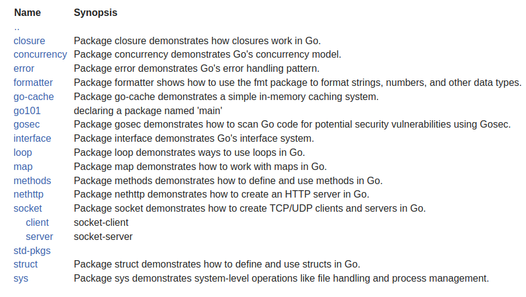

# Go Basics

A collection of [Go](https://go.dev/) programming topics with helpful comments. Covers the fundamentals of the language.

Explore the code, ask questions, and contribute!

The above image is taken from the result of godoc. Run `godoc -http=:6060` and go to [pkg/go-basics](http://localhost:6060/pkg/go-basics/)
